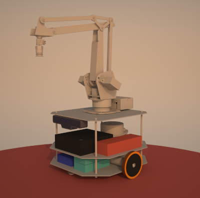
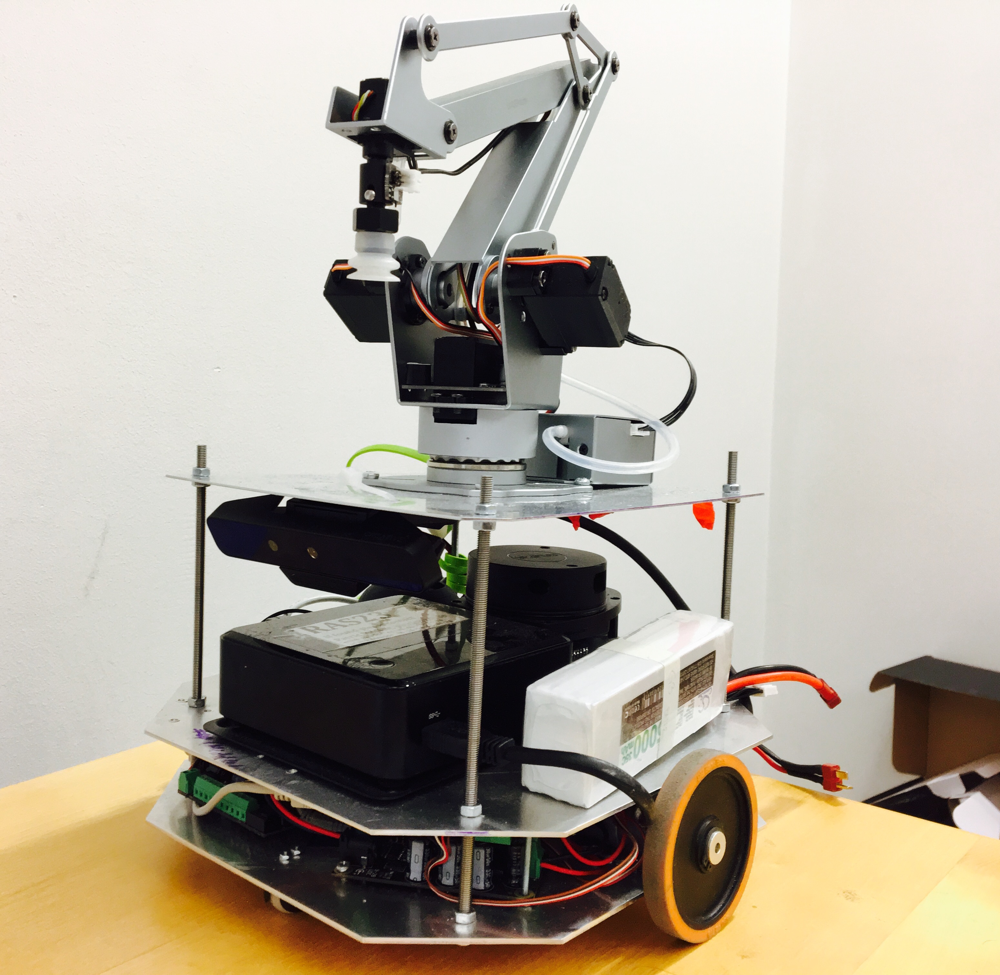

Metapackage for the custom mobile robot called "Snoopy". Snoopy was equipped with a LIDAR, an RGB-D camera, motor encoders and a uArm. 

## Necessary packages to build the package
ros_control pkg: "sudo apt-get install ros-indigo-ros-control ros-indigo-ros-controllers"

# snoopy
ROS Metapackage for Snoopy 

# snoopy_launch
General launch files for Snoopy

# snoopy_setup
General files and nodes for setting up the snoopy including YAML parameter files, brain, tf broadcasting and listener nodes, exploration node etc...

# snoopy_control
Includes PID node for motor control. 

# snoopy_odom
Includes dead reckoning node. 

# snoopy_teleop
Teleop package for snoopy.

# snoopy_vision
Nodes for object detection, shape classification and color detection from camera.

# snoopy_pathfind
Package for astar service.

# snoopy_localize
Package for particle filter and pose fusion.

# snoopy_navigate
Package for navigation action. 

# snoopy_map
Package contains map server. 

# snoopy_uarm
Package for uarm.
